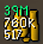

# Exact Stacks

RuneLite plugin that shows exact stackable item quantities broken down by denomination. Instead of seeing only the game's rounded value (e.g. "39m"), your inventory and bank slots show the remaining breakdown at a glance.

## Features

- Shows the K and individual-unit remainder hidden by the game's rounded display
- Applies to coins and any other stackable item
- Bank and inventory visibility independently togglable
- Only shows what the game doesn't: below 10M the game already displays the K value (e.g. `5250K`), so only the sub-K units are added; from 10M the game shows `M`, so both the K and sub-K remainder are added

## Examples

| In-game display | Breakdown shown |
|----------------|-----------------|
| 39M            | `861K` + `640` |
| 5250K          | `640` |
| 101K           | `123` |
| 2,147M         | `483K` + `647` |

## Configuration

- **Show in inventory** – Show breakdown on items in your inventory (default: ON).
- **Show in bank** – Show breakdown on items in the bank grid (default: ON).
- **Show individual units** – Show amounts less than 1K (e.g. `640`). Uncheck to show only K values (default: ON).

## Notes

- The game already renders the largest rounded denomination (`xK` from 100K, `xM` from 10M) — the plugin only shows the remaining detail.
- Config changes for inventory/bank visibility take effect immediately.
